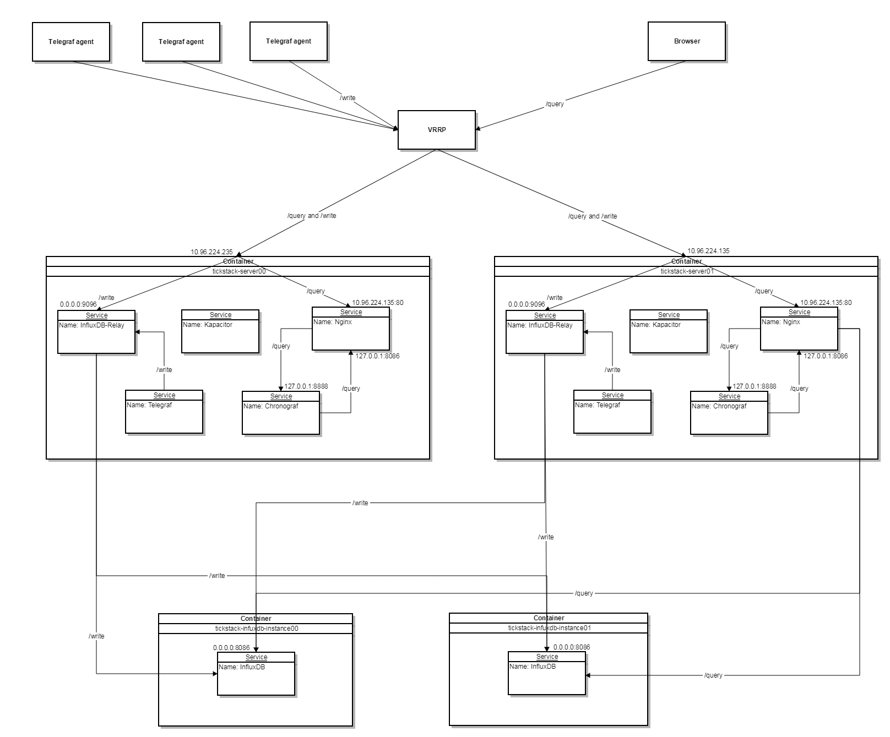

# tickstack-chronograpf

## Purpose

This role is used to install and configure a Chronograf service into a LXD container on a Head Node.

## Overview

Chronograf is InfluxData’s open source web application. Use Chronograf with the other components of the TICK stack to visualize your monitoring data and easily create alerting and automation rules

## General diagram



## Requirements

- Debian-based Linux distribution
- LXD

## Role Variables

| Variable | Default | Description |
|----------|---------|-------------|
|`chronograf_bind_address`|`127.0.0.1`| An IPv4 address to bind on while a service is up and running. |
|`chronograf_bind_port`|`8888`| A TCP port that Chronograf will listen on. |
|`chronograf_url`|`http://127.0.0.1:8888`| A URL to access Chonograf. |
|`telegraf_influxdb_username`|`chronograf`| The username that is used to authorize Chronograf in database. |
|`telegraf_influxdb_password`|``| The password that is used to authorize Chronograf in database. |

## Dependencies

This role depends on the following roles:
 - tickstack-influxdb
 - jdauphant.nginx

## Example Playbook

````yaml
- hosts: tickstack-server
  any_errors_fatal: true
  become: yes
  roles:
    - role: tickstack-chronograf
````

## License

BSD

## Author Information


